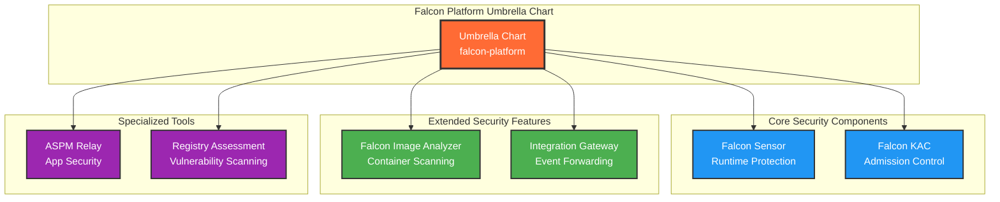

# CrowdStrike Falcon Platform Helm Chart

A comprehensive umbrella Helm chart that deploys the complete CrowdStrike Falcon security platform for Kubernetes environments. This chart manages all individual Falcon components as dependencies, providing a unified deployment and configuration experience.

## Overview

The Falcon Platform umbrella chart allows you to deploy and manage the entire CrowdStrike Falcon security stack with a single Helm installation. It coordinates the deployment of multiple security components while providing centralized configuration management and deployment orchestration.

## Architecture



## Components Included

| Component | Purpose | Default Status | Requirements |
|-----------|---------|----------------|--------------|
| **Falcon Sensor** | Runtime node protection and monitoring | ✅ Enabled | CID |
| **Falcon KAC** | Kubernetes admission controller | ✅ Enabled | CID |
| **Falcon Image Analyzer** | Container image vulnerability scanning | ❌ Disabled | CID + OAuth credentials + cluster name |
| **Falcon Integration Gateway** | Event forwarding to external systems | ❌ Disabled | OAuth credentials + backend config |
| **ASPM Relay** | Application security posture management | ❌ Disabled | Access token + region |
| **Registry Assessment** | Self-hosted registry vulnerability scanning | ❌ Disabled | Extensive configuration |

## Quick Start

### 1. Add the Helm Repository

```bash
helm repo add crowdstrike https://crowdstrike.github.io/falcon-helm
helm repo update
```

### 2. Minimal Installation

Deploy core security components (Sensor + Admission Controller):

```bash
helm upgrade --install falcon-platform crowdstrike/falcon-platform \
  --set global.falcon.cid="YOUR_CROWDSTRIKE_CID_HERE" \
  --create-namespace \
  --namespace falcon-system
```

### 3. Comprehensive Installation

Deploy all components (requires additional configuration):

```bash
# Create a values file with your configuration
cat > falcon-platform-values.yaml << EOF
global:
  falcon:
    cloud_region: "us-1"
  # Use external secret for sensitive values
  falconSecret:
    enabled: true
    secretName: "falcon-credentials"

falcon-sensor:
  enabled: true

falcon-kac:
  enabled: true

falcon-image-analyzer:
  enabled: true
  crowdstrikeConfig:
    clientID: "YOUR_OAUTH_CLIENT_ID"
    clientSecret: "YOUR_OAUTH_CLIENT_SECRET"  
    agentRegion: "us-1"
    clusterName: "your-cluster-name"

EOF

# Create the secret first
kubectl create secret generic falcon-credentials \
  --from-literal=FALCONCTL_OPT_CID="YOUR_CID_HERE" \
  --from-literal=FALCONCTL_OPT_PROVISIONING_TOKEN="YOUR_TOKEN" \
  -n falcon-system --dry-run=client -o yaml | kubectl apply -f -

helm upgrade --install falcon-platform crowdstrike/falcon-platform \
  -f falcon-platform-values.yaml \
  --create-namespace \
  --namespace falcon-system
```

## Configuration

### Global Configuration

Global settings apply to all components unless overridden:

```yaml
global:
  falcon:
    cid: "YOUR_CID_HERE"              # Required for all components
    cloud_region: "us-1"              # Optional: us-1, us-2, eu-1, us-gov-1
    
  # Global Falcon Secret configuration (alternative to CID)
  falconSecret:
    enabled: false                    # Use external Kubernetes secret
    secretName: ""                    # Name of secret with FALCONCTL_OPT_CID
  
  registry:
    repository: "registry.crowdstrike.com"  # Default registry
    pullSecrets: []                          # Image pull secrets
  
  namespace: falcon-system                   # Target namespace
```

### Component-Specific Configuration

Each component can be individually configured. Component-specific values override global settings:

```yaml
# Enable/disable components
falcon-sensor:
  enabled: true
  # All falcon-sensor chart values can be specified here
  # Global falconSecret will be inherited if not specified
  
falcon-kac:
  enabled: true
  # All falcon-kac chart values can be specified here  
  # Global falconSecret will be inherited if not specified

# Components requiring additional configuration  
falcon-image-analyzer:
  enabled: false  # Disabled by default
  crowdstrikeConfig:
    clientID: ""      # Required
    clientSecret: ""  # Required  
    agentRegion: ""   # Required
    clusterName: ""   # Required
```

### Using External Secrets

Instead of specifying sensitive values directly in Helm values, you can use Kubernetes secrets:

```yaml
global:
  # Option 1: Use CID directly (less secure)
  falcon:
    cid: "YOUR_CID_HERE"
    
  # Option 2: Use external secret (more secure)
  falconSecret:
    enabled: true
    secretName: "falcon-credentials"
```

When using `falconSecret`, create the secret beforehand:

```bash
# Create secret with required Falcon credentials
kubectl create secret generic falcon-credentials \
  --from-literal=FALCONCTL_OPT_CID="YOUR_CID_HERE" \
  --from-literal=FALCONCTL_OPT_PROVISIONING_TOKEN="YOUR_TOKEN" \
  -n falcon-system
```

**Note**: The `falconSecret` configuration is inherited by `falcon-sensor` and `falcon-kac` components, which both support external secret injection.

### Deployment Orchestration

The umbrella chart supports phased deployment for proper initialization:

```yaml
deploymentConfig:
  phaseDeployment:
    enabled: true
    
    phase1:  # Core infrastructure
      - falcon-sensor
      
    phase2:  # Policy enforcement
      - falcon-kac
      
    phase3:  # Extended features
      - falcon-image-analyzer
      
```

## Deployment Scenarios

### Scenario 1: Basic Production Setup

Core runtime protection and admission control:

```yaml
global:
  falcon:
    cid: "YOUR_CID"

falcon-sensor:
  enabled: true

falcon-kac:
  enabled: true

# All other components disabled
```

### Scenario 2: Comprehensive Security

Full security coverage with scanning and monitoring:

```yaml
global:
  falcon:
    cid: "YOUR_CID"
    cloud_region: "us-1"

falcon-sensor:
  enabled: true

falcon-kac:
  enabled: true

falcon-image-analyzer:
  enabled: true
  crowdstrikeConfig:
    clientID: "CLIENT_ID"
    clientSecret: "CLIENT_SECRET"
    agentRegion: "us-1"  
    clusterName: "production-cluster"

```

## Prerequisites

### Minimum Requirements
- Kubernetes 1.22+
- Helm 3.x
- CrowdStrike Customer ID (CID)
- Appropriate cluster permissions (cluster-admin for installation)

### Component-Specific Requirements

**Falcon Image Analyzer:**
- OAuth API credentials (Client ID + Secret)  
- Kubernetes cluster name
- Container registry access


## Verification

### Check Installation Status

```bash
# Check all pods in the falcon namespace
kubectl get pods -n falcon-system

# Check individual component status
helm status falcon-platform -n falcon-system

# View component logs
kubectl logs -n falcon-system -l app.kubernetes.io/managed-by=falcon-platform
```

### Verify Component Health

```bash
# Sensor status (should show DaemonSet pods on all nodes)
kubectl get daemonset -n falcon-system

# KAC webhook registration
kubectl get validatingadmissionwebhook | grep falcon

# Image analyzer deployment
kubectl get deployment -n falcon-system | grep image-analyzer
```

## Troubleshooting

### Common Issues

1. **Missing CID**: Ensure `global.falcon.cid` is set
2. **Image Pull Errors**: Configure `global.registry.pullSecrets` if using private registries
3. **Webhook Failures**: Check KAC certificate generation and API server connectivity
4. **Node Scheduling**: Verify node tolerations and selectors for DaemonSet components

### Debug Mode

Enable debug logging across all components:

```yaml
advanced:
  debug: true
```

### Component Logs

```bash
# Sensor logs
kubectl logs -n falcon-system -l app=falcon-sensor

# KAC logs  
kubectl logs -n falcon-system -l app=falcon-kac

# Image analyzer logs
kubectl logs -n falcon-system -l app=falcon-image-analyzer
```

## Upgrade Strategy

### Upgrade the Umbrella Chart

```bash
# Update repository
helm repo update

# Upgrade with existing values
helm upgrade falcon-platform crowdstrike/falcon-platform \
  -n falcon-system \
  -f your-values.yaml
```

### Individual Component Updates

Component versions are managed through the umbrella chart's dependencies. Update the umbrella chart to get latest component versions.

## Security Considerations

### Network Policies

Enable network policies to restrict component communications:

```yaml
advanced:
  networkPolicy:
    enabled: true
```

### Pod Security Standards

Configure appropriate pod security contexts:

```yaml
commonConfig:
  securityContext:
    runAsNonRoot: true
    readOnlyRootFilesystem: true
    allowPrivilegeEscalation: false
```

## Uninstall

```bash
# Remove the platform and all components
helm uninstall falcon-platform -n falcon-system

# Optionally remove the namespace
kubectl delete namespace falcon-system
```
